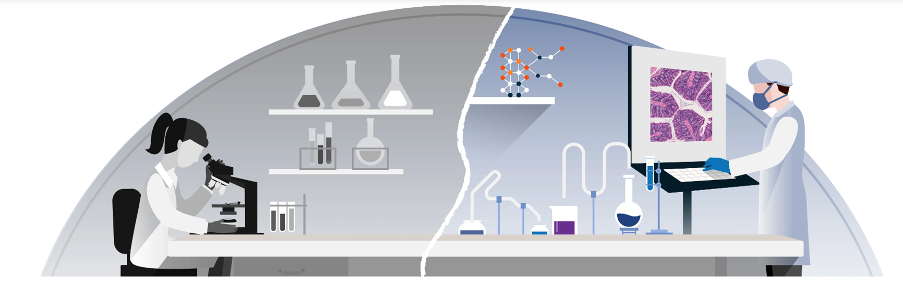
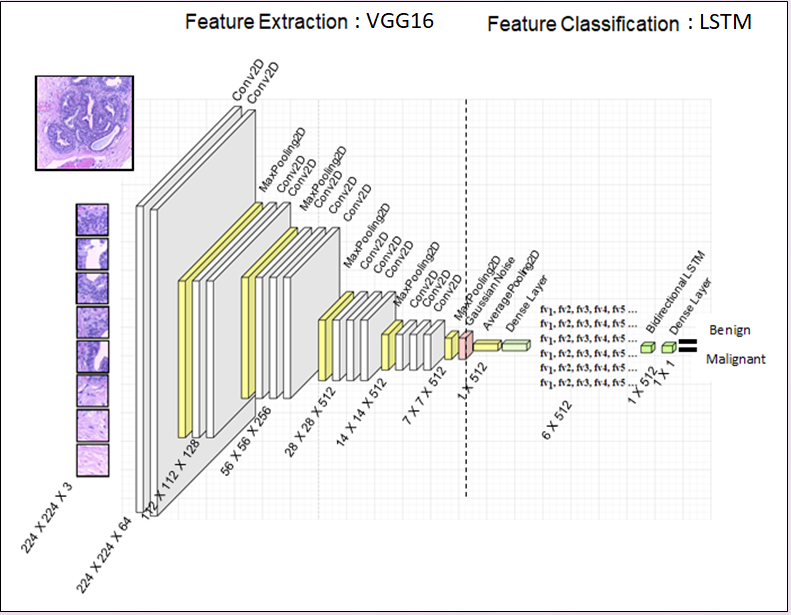

  

<h1 align="center">
Leveraging Deep Learning and Medical Image Analysis for Enhanced Breast Cancer Diagnosis </h1>

Deep Learning has brought remarkable advancements to the field of medical image analysis, introducing algorithms like CNN, RNN, and GAN etc. These algorithms aim to enhance the precision of cancer diagnostics and reduce errors. In the context of breast cancer histopathological images, this study explores various strategies to boost classification accuracy.
This study introduces a novel approach tailored for high-resolution histopathology analysis, aiming to enhance both accuracy and performance in medical image classification. The intricate details present in histopathological images play a crucial role in accurate cancer detection and characterization. However, the complexity of these images poses challenges, demanding specialized methodologies.

The presented architecture leverages the benefits of patch-based image analysis by integrating the VGG16 model with an LSTM classifier. This combination results in a powerful solution for precise classification of high-resolution histology images. By utilizing pre-trained models as feature extractors, the system gains the ability to capture intricate image features that contribute to accurate diagnoses. The LSTM classifier further enhances accuracy by capturing temporal dependencies among image patches, addressing context gaps often overlooked in traditional approaches.

This strategy's effectiveness becomes evident through its outcomes. Achieving an impressive 90.81% Accuracy, along with high Precision, Recall, and AUC values at 100X magnifications, underscores the model's prowess in high-resolution analysis. Notably, this approach outperforms conventional whole-slide image analysis, highlighting its advantage in capturing finer details for accurate classification.

Beyond accuracy, this methodology also offers enhanced performance. The patch-based approach optimally processes large-dimensional tumour regions without the need for resource-intensive whole-slide image analysis. This scalability contributes to quicker processing times, allowing for swift predictions and efficient utilization of computational resources.

  

